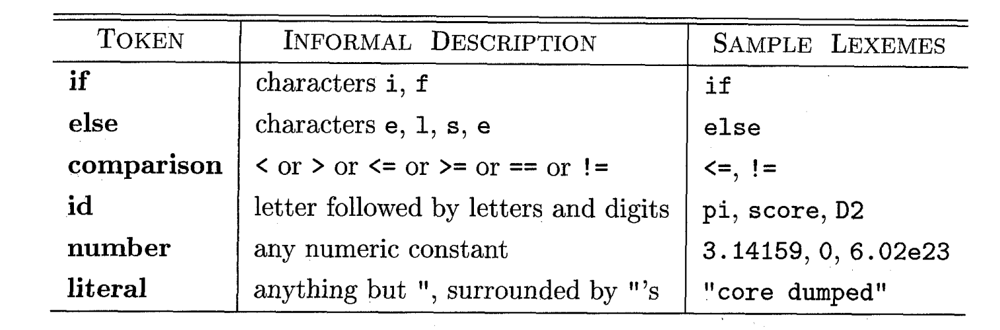
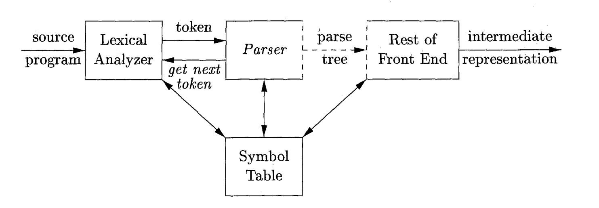
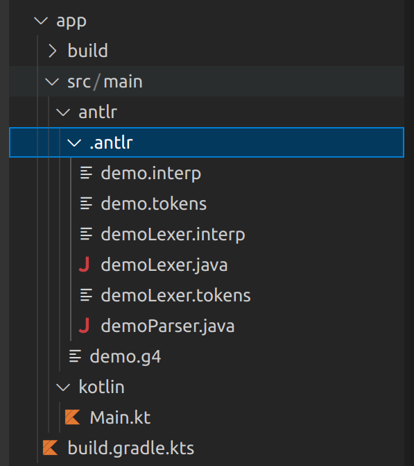

# 05 - ANTLR Lexer et Parser

Le TP précédent, on a vu comment écrire des grammaire pour décrire les langages de programmation. Maintenant, on commence la transition de la partie des langages formels vers les compilateurs.

## Lexer
Le **Lexer** est une composante du compilateur. Son but est de lire le texte d’entrée (qui est notre programme source) et de produire en tant que sortie une **séquence de jétons**. Les erreurs qui apparaissent au niveau du Parser sont des **erreurs d’analyze lexicale**.

Dans le contexte du Lexer, on introduit les définitions suivantes:
- le **jéton** (**token**) est une paire qui contient le nom du jéton et une valeur. Le nom du jéton est un symbole abstrait qui représente un genre d’unité lexicale. 
- le **modèle** est une description de la forme que les lexemes d’un jéton peuvent avoir. Si le jéton représent un mot clé (par exemple, le mot clé if), le jétons est une chaîne de caractères qui composent le mot. Pour d’autres situations (par exemple, pour définir des noms pour les variables), on utilise des expréssions plus complexes (comme les RegEx).
- le **lexeme** est une séquence de caractères dans le programme source qui correspond au modèle d’un jéton et est identifié par le Lexer comme une instance du jéton.



## Parser
Le Parser obtient la séquence de jétons produite par le Lexer et vérifie si elle peut être générée par la grammaire du langage source. La sortie du Parser est l’arbre d’analyze (Parse Tree). Les erreurs qui apparaissent au niveau du Parser sont des **erreurs d’analyze syntaxique**.



:::tip
  Vous pouvez ignorer, pour ce TP, le tableu de symboles. On va le discuter dans un TP prochain!
:::

## Grammaires avec ANTLR4
À partir de ce TP, on va utiliser ANTLR pour l’analyse du texte. ANTLR (ANother Tool For Language Recognition) est un outil pour generer des analyseurs (parsers) qui permettent le traitement, l’exécution et la traduction du code. On va employer ANTLR pour la partie de front-end de notre compilateur.

Pour les grammaires indépendantes du contexte, ANTLR utilise des fichiers `.g4`. Pour écrire une grammaire, il faut créer un fichier avec le même nom que la grammaire que vous souhaitez définir. 

### Terminaux
En ANTLR, on peut même utiliser des productions pour décrire les terminaux. Dans ce cas, le corps de la production doit contenir que des terminaux. On va identifier les terminaux avec des noms qui commencent avec des lettres **MAJUSCULES** (On vous conseile d’utiliser que des majuscules pour les terminaux, pour pouvoir les distinguer plus facilement). D’habitude, on trouve les définitions des terminaux à la fin de la grammaire.

```antlr4
  INTEGER: (-)?[0-9]+ ;  //un terminal pour représenter les nombres entières
  WHITESPACE: ' ' ; //un terminal pour représenter les espaces blancs
  VARIABLE_NAME: [a-zA-Z]+ //un terminal pour représenter les noms des variables
```

### Règles

On va identifier les non-terminaux avec des lettres **minuscules**.

:::warning
En ANTLR, on **ne peut pas avoir des productions avec la même tête**. Ce qu’on peut faire, c’est de mettre les deux corps dans un seul et de les séparer avec l’opérateur `|`.
:::

```antlr4
  assignment: VARIABLE_NAME '=' INTEGER ; //une règle pour représenter une affectation
  
  //une règles pour représenter une expression d'addition
  addition: addition '+' INTEGER
          | INTEGER
          ;
```

## Exemple
Prenons la grammaire de la semaine dernière et écrivons-la en ANTLR:

```antlr4
grammar demo;

ZERO: '0';
ONE: '1'; 
p : s '+'s;
s : ZERO s ONE  
  | ZERO ONE
  |;
```

## Parser et Lexer avec ANTLR
Au lieu d’écrire vous-même le lexer et le parser, ANTLR peut les générer automatiquement à partir de votre grammaire. Vous devez seulement les utiliser dans votre code.

Le fichier avec la grammaire doit se trouver sous le chemin `src/main/antlr`. Après la génération, vous trouvez aussi le dossier `.antlr`, qui contient toutes les fichiers générés par antlr.


Pour utiliser cettes nouveaux fichiers dans votre code, il faut seulement instantier les classes:
```kotlin
  import org.antlr.v4.runtime.CharStreams
  import org.antlr.v4.runtime.CommonTokenStream

  fun main(){
      val strToParse = "0011+01"
      val lexer = demoLexer(CharStreams.fromString(strToParse))
      val listOfTokens = lexer.allTokens
      for(token in listOfTokens){
          println("Token with value ${token.text} found at line ${token.line} starting from index ${token.startIndex}")
      }
      val parser = demoParser(CommonTokenStream(lexer))
      val tree = parser.p()
  }
```

Les methodes du parser sont obtenues à partir de la grammaire. Dans cet exemple, on commence la construction de l'arbre d’analyse avec la production qui a comme tête la variable $p$. D’habitude, on commence l’analyse avec la régle de début de notre grammaire.

:::tip
  Les noms du lexer et parser auront le format suivant: `<nom_de_votre_grammaire\>Lexer` et `<nom_de_votre_grammaire>Parser`. Ils sont des sous-classes des classes Lexer et Parser. Pour voir plusieurs details sur cettes classes et les methodes qu’elles exposent, on vous conseille d’ouvrir la documentation: [lexer](https://www.antlr.org/api/Java/org/antlr/v4/runtime/Lexer.html) et [parser](https://www.antlr.org/api/Java/org/antlr/v4/runtime/Parser.html).
:::

## Exercices
repondez aux questios:
0. Compilez et exécutez l’exemple dans `TP05/Ex0`. Lisez la sortie, la documentation sur Lexer et Parser et 
1. Ouvrez le dossier `TP5/Ex1`. Suivez les `TODO` de la grammaire dans le fichier `app/src/main/antlr/ex1.g4` pour accepter des déclarations des variable ayant la syntaxe suivante:

```c
  //Exemples - la grammaire doit accepter une seule ligne, pas plusieurs!
  int _var1 = 2;
  float _var2 = 5.55;
  String _var3 = "alf"; 
```
  Les types possibles de données seront: `int`, `float` et `String`. Les noms des variables doivent commencer avec le caractère `_`.
  Modifiez le code dans le fichier `app/src/main/kotlin/Main.kt` pour afficher le nom de la variable déclarée. Exécutez pour tester.

2. Ouvrez le dossier `TP5/Ex2`. Suivez les `TODO` de la grammaire dans le fichier `app/src/main/antlr/ex2.g4` pour ajouter à la grammaire des jetons et des règles pour les expressions mathématiques. Votre grammaire doit reconnaître les opérations et les opérateurs d'addition, soustraction, multiplication et division (+, -, *, /, %). Suivez les étapes nécessaires et testez la fonctionnalité du programme pour l'expression `2+5/10-7`.

```c
  //Exemple
  2+7/5*3;
```

Modifiez le code dans le fichier `app/src/main/kotlin/Main.kt` pour afficher le nombre des opérandes dans l’expression. Exécutez pour tester.

3. Ouvrez le dossier `TP5/Ex3`. Suivez les `TODO` de la grammaire dans le fichier `app/src/main/antlr/ex3.g4` pour ajouter des variables et des paranthèses à vos expressions. Les noms des variables sont celles de l'exercice 1.

```c
  //Exemple
  (2+_var1)/_var2*5;
```

4. Ouvrez le dossier `TP5/Ex4`. Suivez les `TODO` de la grammaire dans le fichier `app/src/main/antlr/ex4.g4` pour écrire une grammaire qui accepte plusieurs instructions. Les instructions peuvent être soit des déclarations des variables, soit des expressions mathématiques.

5. (Bonus) Ouvrez le dossier `TP5/Ex4`. Suivez les `TODO` de la grammaire dans le fichier `app/src/main/antlr/ex4.g4` pour écrire une grammaire dans laquelle les variables puissent être déclarées en utilisant des expressions.
```c
  //Exemple
  int _var3=2*4*10;
  float a; //on peut avoir aussi des déclarations sans expressions
```

## Bibliographie
1. *Compilers: Principles, Techniques & Tools - 2nd Edition* - Chapitres 3.1, 4.1
2. [ANTLR Lexer](https://www.antlr.org/api/Java/org/antlr/v4/runtime/Lexer.html) 
3. [ANTLR Parser](https://www.antlr.org/api/Java/org/antlr/v4/runtime/Parser.html)
   